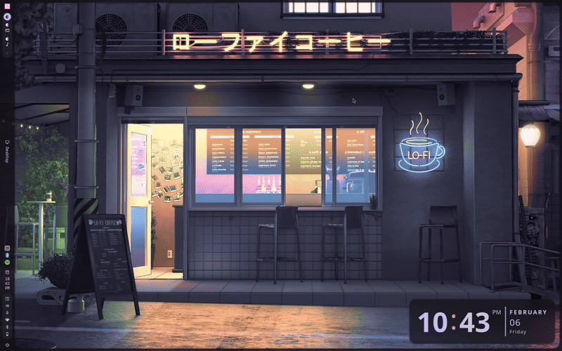

# Caelestia Shell on Ubuntu

[](https://ubuntu.com/)
[](https://hyprland.org/)
[](LICENSE)

Running [Caelestia Shell](https://github.com/caelestia-dots/shell) - a
Quickshell desktop shell built for Hyprland - on Ubuntu, where it was never
meant to run. Caelestia targets Arch and its AUR packages; these guides build
the whole toolchain from source instead.

Every step in both guides was run on a real machine.

## Pick your Ubuntu version

| | Guide | Installer |
|---|---|---|
| **Ubuntu 26.04 LTS** (Resolute Raccoon) | **[docs/ubuntu-26.04.md](docs/ubuntu-26.04.md)** | [`install-26.04.sh`](install-26.04.sh) |
| Ubuntu 25.10 | [docs/ubuntu-25.10.md](docs/ubuntu-25.10.md) | [`install-25.10.sh`](install-25.10.sh) |

```bash
git clone https://github.com/IshmamDC217/caelestia-shell-ubuntu.git
cd caelestia-shell-ubuntu
./install-26.04.sh      # or ./install-25.10.sh
```

## What is different on 26.04

**Hyprland is packaged.** `apt install hyprland` gets you 0.53.3, plus
`hypridle`, `hyprlock`, `hyprpicker`, `hyprpolkitagent` and nine plugins. The
third-party installer the 25.10 guide relied on is no longer needed.

**Qt is one version too old.** 26.04 ships Qt 6.10.2; current Caelestia needs
Qt 6.11. Three things break, and this repo carries a
[89-line patch](patches/qt6.10-compat.patch) that fixes all of them - fully
explained in [the 26.04 guide](docs/ubuntu-26.04.md#the-qt-610-problem).

**Nothing supervises the shell.** Upstream autostarts it once at login, so a
crash leaves you with no bar until you relaunch by hand. The guide ships a
[systemd user service](config/26.04/systemd/caelestia-shell.service) that
restarts it automatically.

**Three fonts are required, not one.** Missing `Material Symbols Rounded`
makes the shell render icon *ligature names* as literal text spilling out of
the bar - it looks like a broken layout but is just a missing font. See
[Step 3: Fonts](docs/ubuntu-26.04.md#step-3-fonts).

**HiDPI laptops need a manual scale.** Hyprland's `auto` picks 2.0 on a 14"
QHD panel, leaving 1280x720 of logical space and making everything look
oversized on the laptop while an external monitor looks fine. The guide covers
[which scales are safe](docs/ubuntu-26.04.md#hidpi-scaling).

**Hyprland 0.53 changed its config schema.** The `gestures {}` block and
one-line `windowrule =` are both gone. The bundled
[`hyprland.conf`](config/26.04/hyprland.conf) is self-contained, uses the new
syntax, and passes `Hyprland --verify-config`.

## Live preview

<p align="center">
  
</p>
<p align="center">
  
</p>
<p align="center">
  
</p>

## Repository layout

```
docs/ubuntu-26.04.md          the 26.04 guide
docs/ubuntu-25.10.md          the 25.10 guide
install-26.04.sh              automated 26.04 installer
install-25.10.sh              automated 25.10 installer
patches/qt6.10-compat.patch   makes current Caelestia build on Qt 6.10.2
config/26.04/                 hyprland.conf, shell.json, qml_color.json
config/25.10/                 the original configs
```

## Credits

- [Caelestia Dots](https://github.com/caelestia-dots) - the shell, by Scout
- [Hyprland](https://hyprland.org/) by [@vaxry](https://github.com/vaxerski)
- [Quickshell](https://quickshell.outfoxxed.me/) by [@outfoxxed](https://github.com/outfoxxed)
- [LukashonakV](https://github.com/LukashonakV) - libcava fork
- [JaKooLit](https://github.com/JaKooLit) - Ubuntu Hyprland installer (25.10 route)

## License

GPL-3.0
